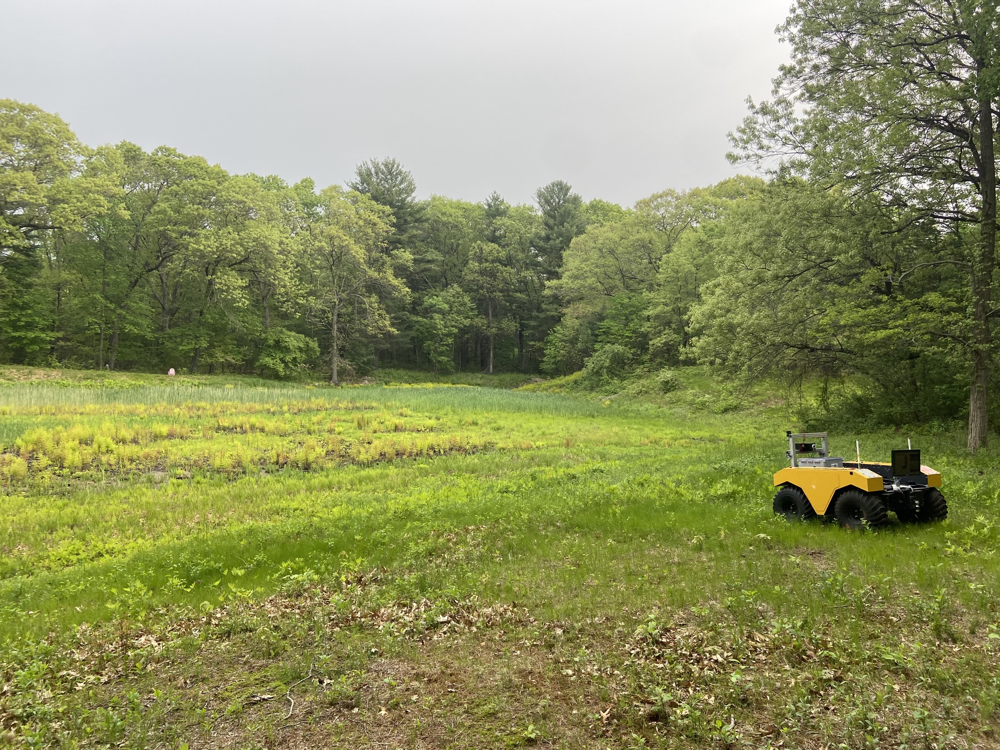

# HYPER DRIVE




### TLDR;
For more detailed instruction, please see the associated [project website](https://river-lab.github.io/hyper_drive_data/) and [manuscript]().

We welcome the use of this dataset and code in your work. If you do use our code/data, please include the following citation:
```
@misc{hanson2023hyperdrive,
  author = {Hanson, Nathaniel and Pyatski, Benjamin and Hibbard, Samuel and DiMarzio, Charles and Padır, Taşkın},
  keywords = {Robotics (cs.RO), Signal Processing (eess.SP), FOS: Computer and information sciences, FOS: Computer and information sciences, FOS: Electrical engineering, electronic engineering, information engineering},
  title = {Hyper-Drive: System Architecture and Data Sets for Visible-Short Wave Infrared Hyperspectral Imaging in Unstructured Environments},
  year = {2023},
  copyright = {Creative Commons Attribution 4.0 International}
}
```
Correspondence: hanson [.] n [@] northeastern [.] edu
