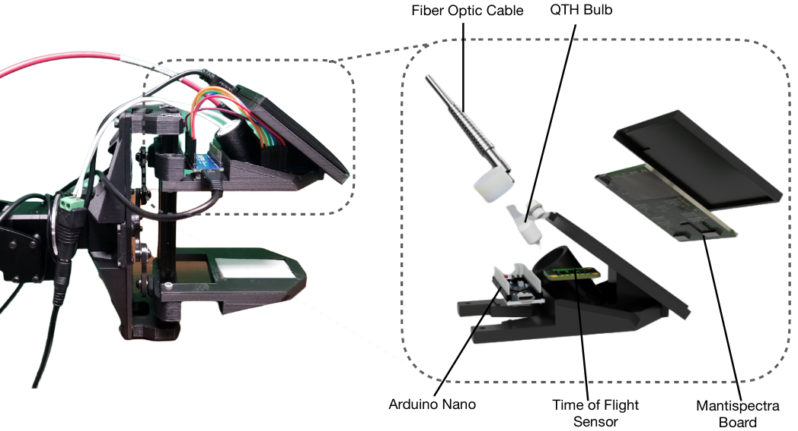

<html lang="en-US">
<head>
  <meta charset="UTF-8">
  <meta name="viewpoint" content="width=device-width, initial-scale=1.0">
  <!--<link rel="stylesheet" href="style.css"> -->
  <title>SLURP! Spectroscopy of Liquids Using Robot Pre-Touch Sensing</title>
</head>
<body>
  <div class="header-adder">
    <div class="title_set">
      <h1>SLURP! Spectroscopy of Liquids Using Robot Pre-Touch Sensing</h1>
    </div>
    <div class="names">
      <p><strong><a href="https://nhanson.io/">Nathaniel Hanson<sup>1* </sup></a>, Wesley Lewis<sup>2*</sup>, <a href="https://kpputhuveetil.github.io/" >Kavya Puthuveetil<sup>2*</sup></a>, Donelle Furline<sup>1</sup>, <a href="https://akhilpadmanabha.github.io/">Akhil Padmanabha<sup>2</sup></a>, <a href="https://www.tpadir.info/">Taşkin Padir<sup>1</sup> </a>, <a href="https://zackory.com/">Zackory Erickson<sup>2</sup></a></strong></p>
      <p style="text-align: center;"><strong>Northeastern University<sup>1</sup>, Carnegie Mellon<sup>2</sup></strong></p></div>
  </div>

  <div>
    <div style="position:relative;padding-top:56.25%;">
      <iframe src="https://www.youtube.com/embed/EFyeUmdglbE" title="YouTube video player" frameborder="0" allow="accelerometer; autoplay; clipboard-write; encrypted-media; gyroscope; picture-in-picture" allowfullscreen style="position:absolute;top:0;left:0;width:100%;height:100%;"></iframe>
    </div>
  </div>
  <h2>Abstract</h2>
  <p>Liquids and granular media are pervasive
  throughout human environments. Their free-flowing nature
  causes people to constrain them into containers. We do so
  with thousands of different types of containers made out
  of different materials with varying sizes, shapes, and colors.
  In this work, we present a state-of-the-art sensing technique
  for robots to perceive what liquid is inside of an unknown
  container. We do so by integrating Visible to Near Infrared
  (VNIR) reflectance spectroscopy into a robot's end effector.
  We introduce a hierarchical model for inferring the material
  classes of both containers and internal contents given spectral
  measurements from two integrated spectrometers. To train
  these inference models, we capture and open source a dataset
  of spectral measurements from over 180 different combinations
  of containers and liquids. Our technique demonstrates over
  85% accuracy in identifying 13 different liquids and granular
  media contained within 13 different containers. The sensitivity
  of our spectral readings allow our model to also identify the
  material composition of the containers themselves with 96%
  accuracy. Overall, VNIR spectroscopy presents a promising
  method to give household robots a general-purpose ability to
  infer the liquids inside of containers, without needing to open
  or manipulate the containers.
  </p>
 
<div style="text-align: center;">
  <figure>
  
      
    <figcaption>
    (Left) Real-world assembly of the SLURP gripper. (Right)
Exploded CAD rendering of SLURP gripper paddle showing inte-
grated visible to near infrared spectrometers and active illumination
associated physical gripper assembly.
    </figcaption>
  </figure>
</div>

  <p>
    <a href="https://github.com/RIVeR-Lab/slurp_grasping/tree/main">Link to the Github</a>
  </p>
</body>
</html>
∗These authors contributed equally
### [ArXiv Link](https://arxiv.org/abs/2210.04941)
### Bibtex
 ```
@misc{https://doi.org/10.48550/arxiv.2210.04941,
  doi = {10.48550/ARXIV.2210.04941},
  url = {https://arxiv.org/abs/2210.04941},
  author = {Hanson, Nathaniel and Lewis, Wesley and Puthuveetil, Kavya and Furline, Donelle and Padmanabha, Akhil and Padır, Taşkın and Erickson, Zackory},
  keywords = {Robotics (cs.RO), Signal Processing (eess.SP), FOS: Computer and information sciences, FOS: Computer and information sciences, FOS: Electrical engineering, electronic engineering, information engineering},
  title = {SLURP! Spectroscopy of Liquids Using Robot Pre-Touch Sensing},
  publisher = {arXiv},
  year = {2022},
  copyright = {Creative Commons Attribution 4.0 International}
}

```
Correspondence: hanson [.] n [@] northeastern [.] edu
