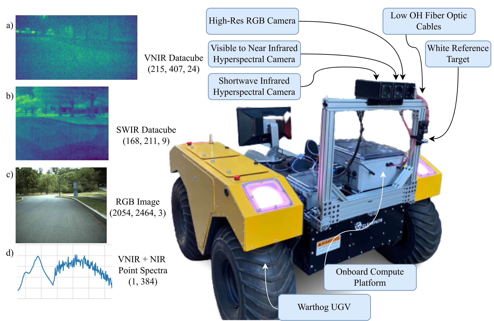

<html lang="en-US">
<head>
  <meta charset="UTF-8">
  <meta name="viewpoint" content="width=device-width, initial-scale=1.0">
  <!--<link rel="stylesheet" href="style.css"> -->
  <title><b>Hyper-Drive</b>: Visible-Short Wave Infrared Hyperspectral Imaging Data Sets for Robots in Unstructured Environments</title>
</head>
<body>
  <div class="header-adder">
    <div class="title_set">
      <h1 style="text-align: center;"><strong>Hyper-Drive</strong> Visible-Short Wave Infrared Hyperspectral Imaging Data Sets for Robots in Unstructured Environments
      </h1>
    </div>
    <div class="names">
      <p style="text-align: center;"><strong><a href="https://nhanson.io/">Nathaniel Hanson<sup>1*</sup></a>, Benjamin Pyatski<sup>1</sup>, <a href="https://www.samuelhibbard.com/">Samuel Hibbard<sup>1</sup></a>, <a href="https://coe.northeastern.edu/people/dimarzio-charles/">Charles DiMarzio<sup>2</sup></a>, <a href="https://coe.northeastern.edu/people/padir-taskin/">Taşkin Padir<sup>1</sup></a></strong></p>
      <p style="text-align: center;"><strong>Institute for Experiential Robotics<sup>1</sup>, Electrical and Computer Engineering Department<sup>2</sup></strong></p>
      <p style="text-align: center;"><strong>Northeastern University, Boston, MA, USA</strong></p>
      </div>
  </div>

  <div>
    <div style="position:relative;padding-top:0%;">
      <figure>
      
        <figcaption>
            Hyperdrive system mounted to Clearpath robotics Warthog embarking on a field data collection.
        </figcaption>
  </figure>
    </div>
  </div>
  <h2>Abstract</h2>
  <p>Towards automated analysis of large environments, hyperspectral sensors must be adapted into a format where they can be operated from mobile robots. In this work, we introduce a first of its kind system architecture with snapshot hyperspectral cameras and point spectrometers to efficiently generate composite datacubes from robotic base. Our system collects and registers datacubes spanning the visible to shortwave infrared (660-1700 nm) spectrum while simultaneously capturing the ambient solar spectrum reflected off a white reference tile. We collect and disseminate a large data set of 500 labeled datacubes from on-road and off-road terrain compliant with the ATLAS ontology to further the integration and demonstration of hyperspectral imaging (HSI) as beneficial in terrain class separability. Our analysis of this data demonstrates HSI is a significant opportunity to increase understanding of scene composition from a robot-centric context.
  </p>
 
<div style="text-align: center;">
  <figure>
  
      
    <figcaption>
    Hyper-Drive system mounted to off-road mobile robot, with sample data representations of white reference target from a) the Visible to Near Infrared (VNIR) hyperspectral camera b) Shortwave Infrared hyperspectral camera c) High resolution RGB camera d) Combined point spectrometers.
    </figcaption>
  </figure>
</div>

  <p>
    <a href="https://github.com/RIVeR-Lab/hyper_drive_data/tree/main">Link to the Github</a>
  </p>
</body>
</html>
### [Paper on ArXiv](https://arxiv.org/abs/2308.08058)
### Bibtex
We hope this data benefits the integration of autonomy and hyperspectral imaging. If you use any of the data or methods from this project, please include this citation in your bibliography.
 ```
@inproceedings{hanson2023hyperdrive,
  author={Hanson, Nathaniel and Pyatski, Benjamin and Hibbard, Samuel and DiMarzio, Charles and Padır, Taşkın},
  booktitle={2023 13th Workshop on Hyperspectral Imaging and Signal Processing: Evolution in Remote Sensing (WHISPERS)}, 
  title={Hyper-Drive: Visible-Short Wave Infrared Hyperspectral Imaging Datasets for Robots in Unstructured Environments}, 
  year={2023},
  volume={},
  number={},
  pages={1-5},
  keywords={Robot vision systems;Systems architecture;Ontologies;Signal processing;Cameras;Mobile robots;Hyperspectral imaging;hyperspectral imaging;robot spectroscopy;multimodal sensing;terrain segmentation},
  doi={10.1109/WHISPERS61460.2023.10430802}}


```
Correspondence: hanson [.] n [@] northeastern [.] edu


### Acknowledgements
Many thanks to the following collaborators for helping to organize and label this data:
* James Tukpah
* Austin Allison
* Rania Alshawabkeh
* Muneer Lalji


Funding Attribution:
```
Research was sponsored by the United States Army Core of Engineers (USACE) Engineer Research and Development Center (ERDC)
Geospatial Research Laboratory (GRL) and was accomplished under 
Cooperative Agreement Federal Award Identification Number (FAIN) W9132V-22-2-0001. 
The views and conclusions contained in this document are those of the authors 
and should not be interpreted as representing the official policies, either expressed or implied,
of USACE EDRC GRL or the U.S. Government. The U.S. Government is authorized to reproduce and distribute reprints for Government purposes notwithstanding any copyright notation herein.
```
